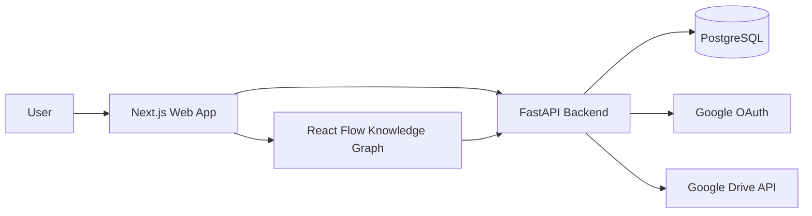
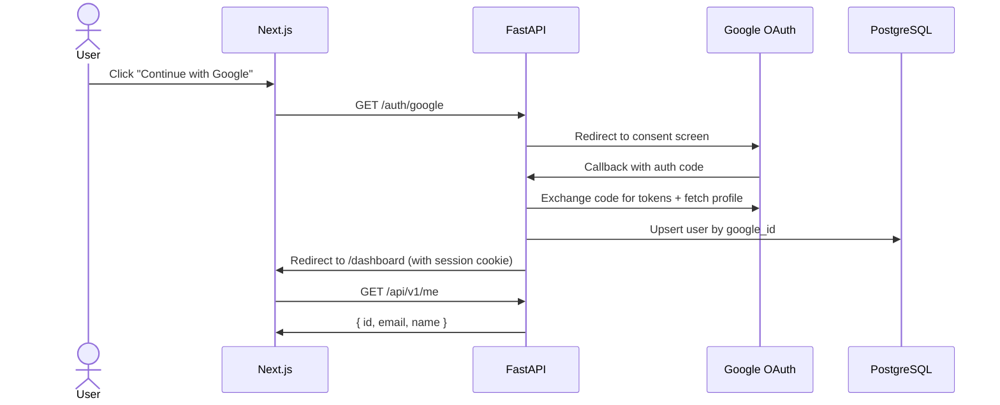
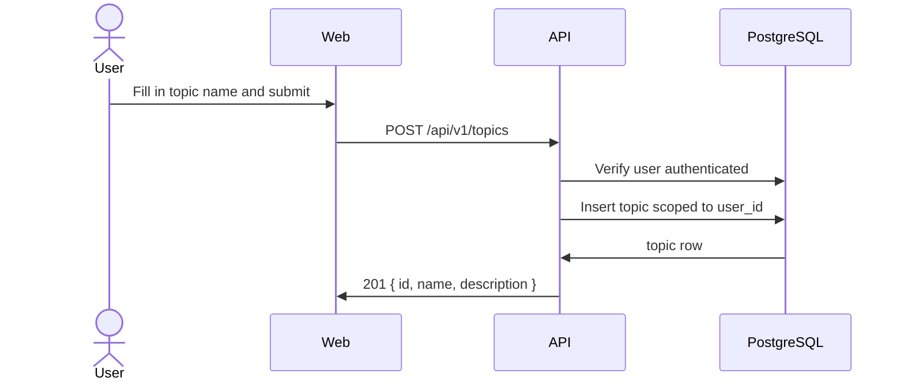
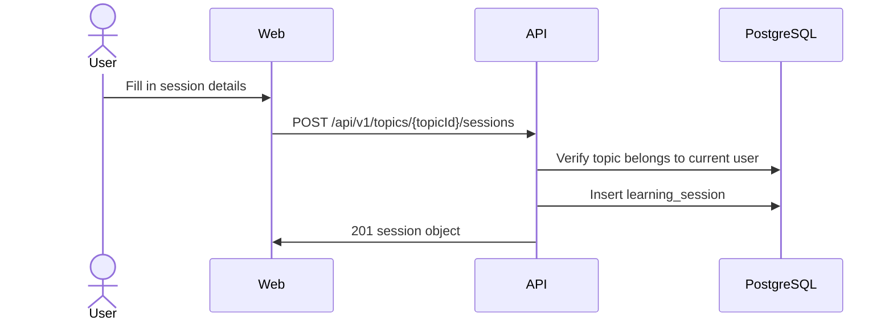
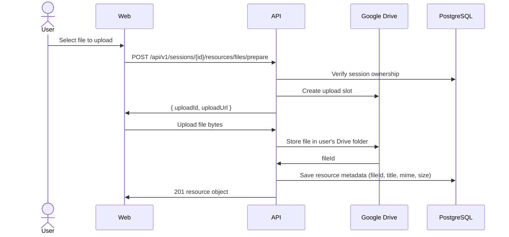
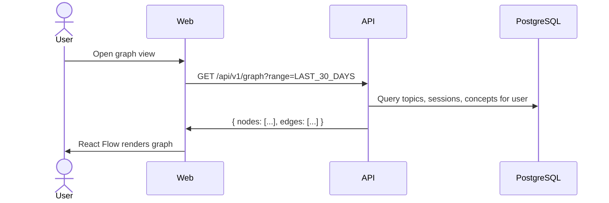

# Architecture

This file covers the full system design for MemoryOS — why it is built this way, how the pieces connect, what the rules are, and what the flows look like. Read this before touching any backend or frontend code.

---

## Decision: why this stack

MemoryOS uses a Python/FastAPI backend, a Next.js frontend, PostgreSQL, and Google Drive for file storage.

Why Python: the roadmap includes RAG, LLMs, and agentic AI workflows. Python has the best ecosystem for all of these. FastAPI is async-first, performant, and generates OpenAPI docs automatically.

Why not something more complex:

- We need to validate the product before investing in infrastructure. A monolith ships faster.
- PostgreSQL handles the knowledge graph in V1. No graph database needed until relational queries prove insufficient.
- Google Drive keeps user files under user ownership. No storage infrastructure to operate early on.
- Google OAuth covers login and Drive access in one flow.
- Strong domain boundaries inside the monolith mean we can split into services later without a rewrite.

The rule: do not add Neo4j, vector databases, Kafka, Redis, or any AI pipeline until real production usage justifies it.

---

## System overview



**Components:**

- Next.js web app — what the user interacts with in the browser.
- FastAPI backend — all business logic, auth, data access.
- PostgreSQL — single source of truth for all data.
- Google OAuth — handles login and issues tokens for Drive.
- Google Drive API — stores user-uploaded files. MemoryOS only stores the file ID and metadata.
- React Flow — renders the knowledge graph in the browser.

---

## Backend domain structure

Each feature lives in its own folder. Every folder has the same internal files.

```
app/
  identity/     — user profile, Google login provisioning
  topics/       — topic CRUD (Phase 2)
  sessions/     — learning session CRUD (Phase 3)
  resources/    — file and link metadata (Phase 4)
  drive/        — Google Drive API integration (Phase 4)
  concepts/     — concept CRUD (Phase 5)
  graph/        — knowledge graph projection (Phase 6)
  dashboard/    — aggregate metrics (Phase 7)
  common/       — config, error handling
  db/           — SQLAlchemy engine and session factory
```

**Files inside each domain folder:**

- `model.py` — SQLAlchemy model, maps 1:1 to the database table.
- `repository.py` — all DB queries, async functions only, no business logic.
- `schemas.py` — Pydantic request and response models.
- `router.py` — FastAPI router, request validation, calls repository, returns schemas.

**Authorization rule — never skip this:**

Every repository or router function that reads or writes data must verify it belongs to the authenticated user.

```python
# Correct — scoped to user
topic = await repository.find_by_id_and_user(db, topic_id, current_user.id)
if not topic:
    raise HTTPException(status_code=404)

# Wrong — leaks other users' data
topic = await repository.find_by_id(db, topic_id)
```

---

## Frontend structure

```
apps/frontend/src/
  app/          Next.js App Router pages, one folder per route
  components/   Shared UI components (AppShell, etc.)
  features/     Feature-specific logic, one folder per domain
  lib/          api.ts (backend calls), config.ts (env vars and URLs)
  styles/       Global CSS
```

Rules:
- Authenticated pages must use the `AppShell` component.
- Backend calls go through `lib/api.ts`, not scattered inline.
- New routes go in `app/{route-name}/page.tsx`.
- New feature logic (forms, hooks, state) goes in `features/{domain}/`.

---

## Validation rules

These are enforced at the router/service layer:

- Difficulty must be an integer from 1 to 10.
- Topic name is required and must be unique per user (case-insensitive).
- Learning session title is required.
- Resource type must be one of the supported enum values.
- File upload metadata must include the Google Drive file ID after upload completes.

---

## Observability

Every environment (including local) should have:

- Health endpoint: `GET /health`
- Auto-generated OpenAPI docs: `GET /docs` (FastAPI built-in)
- Structured error responses using the standard format (see `docs/architecture/api.md`)
- Authentication failure returns 401 without leaking session details
- A generic exception handler so unhandled errors return JSON, not a traceback

Production will also need structured JSON logs and request correlation IDs (planned, not yet implemented).

---

## Deployment plan (future)

- Frontend: Vercel or containerised Next.js
- Backend: containerised Python/FastAPI on AWS ECS, Cloud Run, or Fly.io
- Database: managed PostgreSQL (AWS RDS, Supabase, or similar)
- Secrets: cloud secret manager or platform environment variables

Start with stateless backend instances, connection pooling, and indexed queries. Scale only when usage demands it.

---

## Sequence flows

### Google Login



### Create Topic (Phase 2)



### Add Learning Session (Phase 3)



### Upload File to Google Drive (Phase 4)



### Load Knowledge Graph (Phase 6)



---

## Google Drive integration design

**Why Drive:** Users own their files. We do not operate storage infrastructure. Drive access comes naturally from the Google OAuth login already in place.

**OAuth scopes needed:**
- `openid`, `profile`, `email` (already in use)
- `https://www.googleapis.com/auth/drive.file` — only files created by our app, not full Drive access

**Upload flow:**
1. Backend verifies the learning session belongs to the current user.
2. Backend uploads the file to Google Drive using the user's token.
3. Backend saves resource metadata: type, title, Drive file ID, MIME type, size, session ID.

**Folder structure in Drive:**
```
MemoryOS/
  {topic-name}/
    {session-title}/
      uploaded-file.pdf
```

**Failure handling:**
- Drive upload fails → do not create metadata. Return error to frontend.
- Metadata save fails after Drive upload → log the orphaned Drive file ID for manual cleanup.
- Never expose OAuth tokens to the frontend.

---

## Knowledge graph design

**What it shows:** Topics, learning sessions, and concepts as nodes. Edges connect them: topic → session → concept.

**How it works in V1:** The graph is generated dynamically from PostgreSQL. No graph database. The backend queries the relational tables and returns a node/edge payload. React Flow renders it.

**Node types:**
- Topic — large, prominent node
- Learning Session — medium node, shows date and difficulty
- Concept — compact node

**Time filters:** TODAY, LAST_7_DAYS, LAST_30_DAYS, LAST_3_MONTHS, LAST_6_MONTHS, LAST_YEAR, ALL_TIME

**Future (not in V1):** AI-generated semantic edges, knowledge decay coloring, graph database persistence.
