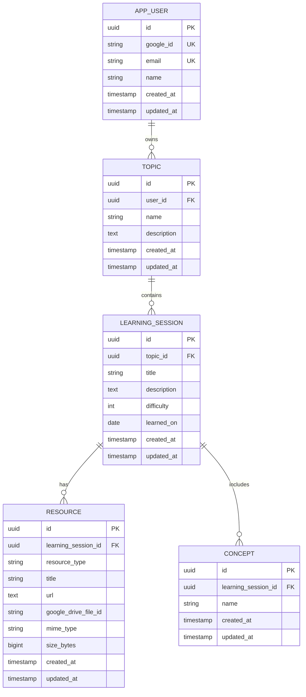

# Database ER Diagram

## Mermaid ERD

## Recommended Indexes

- `app_user.google_id`
- `app_user.email`
- `topic.user_id`
- unique `topic(user_id, lower(name))`
- `learning_session.topic_id`
- `learning_session.learned_on`
- `resource.learning_session_id`
- `concept.learning_session_id`
- `concept.name`

## Notes

Use UUID primary keys to avoid exposing sequential IDs and to make future distributed writes easier if needed.

