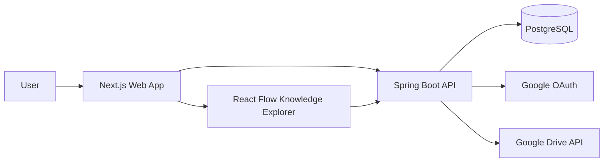

# High-Level Architecture

## System Overview

MemoryOS is composed of:

- Web client: Next.js application used by learners.
- API backend: Spring Boot application exposing authenticated REST APIs.
- Database: PostgreSQL storing users, topics, sessions, resources, and concepts.
- File storage: Google Drive owned by each authenticated user.
- OAuth provider: Google OAuth for login and Drive authorization.

## Architecture Diagram

## Core Runtime Flow

1. User signs in with Google.
2. Backend creates or updates the user profile.
3. User creates topics.
4. User adds learning sessions under topics.
5. User attaches links and files.
6. File uploads go to the user's Google Drive.
7. Concepts are stored under learning sessions.
8. Graph APIs derive topic, session, and concept relationships from PostgreSQL.
9. Frontend renders the graph with React Flow.

## Deployment Shape

Initial production deployment can use:

- Frontend: Vercel, Netlify, or containerized Next.js.
- Backend: containerized Spring Boot service on AWS ECS, Google Cloud Run, Fly.io, Render, or Kubernetes later.
- Database: managed PostgreSQL.
- Secrets: cloud secret manager or managed environment variables.

## Scalability Strategy

Start with a modular monolith. Split only when operational pressure appears.

Early scaling priorities:

- Stateless backend instances.
- Connection pooling.
- Indexed relational queries.
- CDN for frontend assets.
- Rate limiting on APIs.
- Background jobs only when upload or AI workflows require them.

