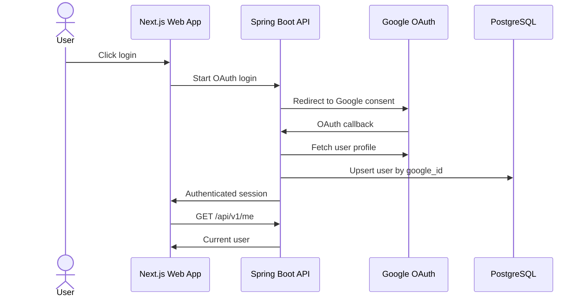
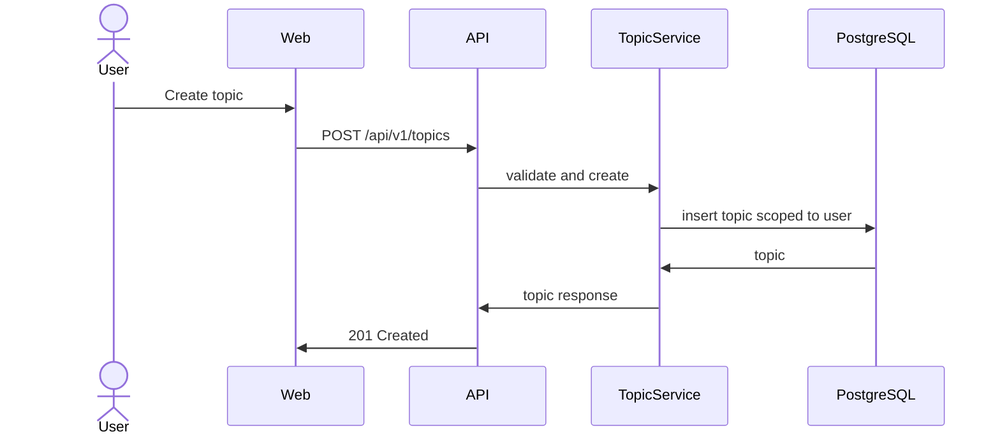
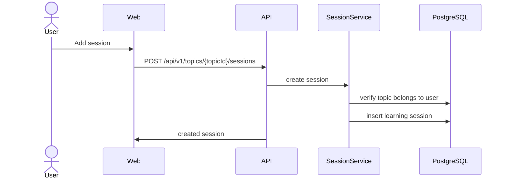
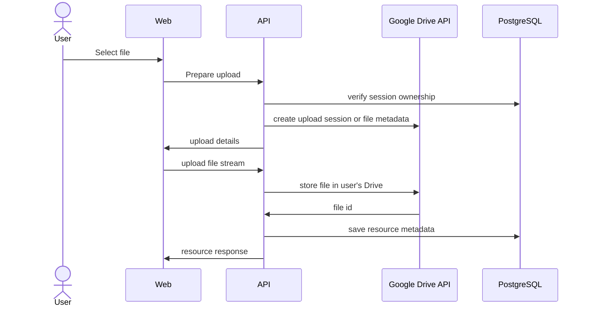
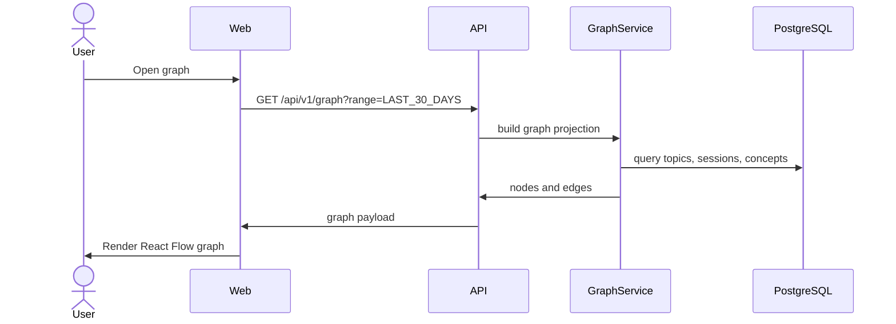

# Sequence Diagrams

## Google Login

```mermaid
sequenceDiagram
  actor User
  participant Web as Next.js Web App
  participant API as Spring Boot API
  participant Google as Google OAuth
  participant DB as PostgreSQL

  User->>Web: Click login
  Web->>API: Start OAuth login
  API->>Google: Redirect to Google consent
  Google->>API: OAuth callback
  API->>Google: Fetch user profile
  API->>DB: Upsert user by google_id
  API->>Web: Authenticated session
  Web->>API: GET /api/v1/me
  API->>Web: Current user
```

## Create Topic

```mermaid
sequenceDiagram
  actor User
  participant Web
  participant API
  participant Service as TopicService
  participant DB as PostgreSQL

  User->>Web: Create topic
  Web->>API: POST /api/v1/topics
  API->>Service: validate and create
  Service->>DB: insert topic scoped to user
  DB->>Service: topic
  Service->>API: topic response
  API->>Web: 201 Created
```

## Add Learning Session

```mermaid
sequenceDiagram
  actor User
  participant Web
  participant API
  participant Service as SessionService
  participant DB as PostgreSQL

  User->>Web: Add session
  Web->>API: POST /api/v1/topics/{topicId}/sessions
  API->>Service: create session
  Service->>DB: verify topic belongs to user
  Service->>DB: insert learning session
  API->>Web: created session
```

## Attach File Resource

```mermaid
sequenceDiagram
  actor User
  participant Web
  participant API
  participant Drive as Google Drive API
  participant DB as PostgreSQL

  User->>Web: Select file
  Web->>API: Prepare upload
  API->>DB: verify session ownership
  API->>Drive: create upload session or file metadata
  API->>Web: upload details
  Web->>API: upload file stream
  API->>Drive: store file in user's Drive
  Drive->>API: file id
  API->>DB: save resource metadata
  API->>Web: resource response
```

## Load Knowledge Graph

```mermaid
sequenceDiagram
  actor User
  participant Web
  participant API
  participant Graph as GraphService
  participant DB as PostgreSQL

  User->>Web: Open graph
  Web->>API: GET /api/v1/graph?range=LAST_30_DAYS
  API->>Graph: build graph projection
  Graph->>DB: query topics, sessions, concepts
  Graph->>API: nodes and edges
  API->>Web: graph payload
  Web->>User: Render React Flow graph
```

